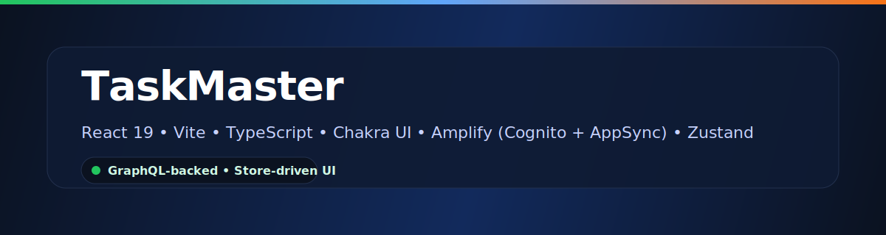
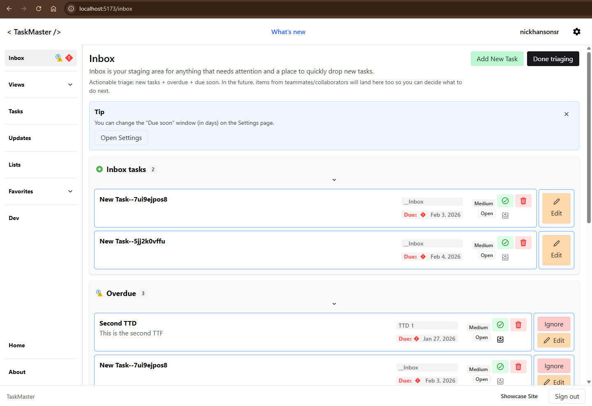
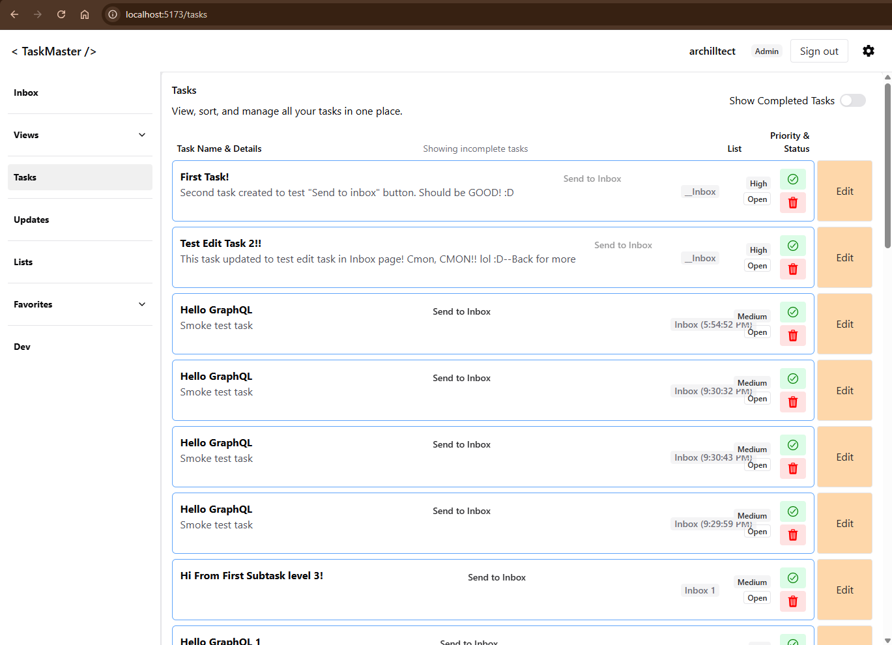
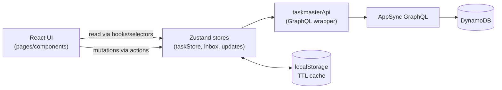

<!-- {root}/README.md -->

<p align="center">
  
</p>

<p align="center">
  <a href="https://vitejs.dev/"></a>
  <a href="https://react.dev/"></a>
  <a href="https://www.typescriptlang.org/"></a>
  <a href="https://chakra-ui.com/"></a>
  <a href="https://zustand-demo.pmnd.rs/"></a>
  <a href="https://docs.amplify.aws/"></a>
</p>

# TaskMaster

TaskMaster is a task app prototype built with **Vite + React 19 + TypeScript + Chakra UI**, backed by **AWS Amplify** (**Cognito Auth + AppSync GraphQL + DynamoDB**) and a **Zustand** state architecture.

The UI is **store-driven**:
- Reads go through Zustand hooks/selectors
- Writes go through store actions → `taskmasterApi` → GraphQL
- A persisted local cache (with TTL refresh) makes reloads fast

---

## ✨ Features

- Authenticated app shell (sidebar + top bar)
- Inbox triage (system Inbox staging + overdue/due-soon indicators across all lists)
- Task lists + tasks (GraphQL-backed)
- Task details “pane stack” navigation (deep-linkable)
- Updates feed + read markers (local/persisted UX state)
- Settings: default landing/view routes, reset ignored Inbox notifications, and demo data controls
- Storage disclosure banner (acknowledgement persisted)
- Admin-only console (`/admin`) for cross-user inspection (email → account → lists → tasks)
  - Note: intentionally read-only for now (admin item editing/deleting is deferred)
- Dev-only GraphQL smoke testing route (`/dev`)

---

## 📸 Screenshots

<p align="center">
  
  
</p>

---

## 🧱 Tech stack

- React 19 + TypeScript + Vite
- Chakra UI (UI primitives)
- React Router v7 (`react-router-dom`)
- Zustand (client state + persisted caches)
- AWS Amplify Gen 1
  - Cognito (Auth)
  - AppSync GraphQL + DynamoDB (`@model`)

---

## 🚀 Quickstart

```bash
npm install
npm run dev
```

## ✅ MVP QA / confidence checks

Manual tester checklist (shareable):
- [docs/TESTER_SCRIPT.md](docs/TESTER_SCRIPT.md)

Automated smoke + a11y (Playwright + axe):

```bash
# first time only
npm run test:e2e:install

# run smoke tests (desktop + mobile)
npm run test:e2e

# optional: generate/view HTML report
npm run test:e2e:html
npm run test:e2e:report
```

Note: E2E runs use a test-only auth bypass (`VITE_E2E_BYPASS_AUTH=1`) so the smoke suite does not require live AWS connectivity.
Do not enable this flag in production builds/hosts.

Quality checks:

```bash
npm run lint
npm run build
```

Bundle analysis (treemap report):

```bash
npm run build:analyze
```

This writes `dist/bundle-report.html` (open it in a browser to inspect which dependencies contribute to each chunk).

## 🔐 Security / known issues (MVP)

- Dependency audit status and tracking plan live in [docs/SECURITY_CHECKLIST.md](docs/SECURITY_CHECKLIST.md) (includes a reproducible `npm audit` + summarizer workflow).
- As of Feb 2026, `npm audit --omit=dev` still reports high-severity advisories that are **transitive** through `aws-amplify` / AWS SDK internals (not direct app code).
  - Fixing these cleanly appears to require disruptive dependency shifts (major-version changes), so the MVP documents the risk and waits for upstream-safe upgrades.
- A previously reported `lodash` advisory is mitigated via an npm override in [package.json](package.json).

---

## 🧭 Key implementation locations

- App bootstrapping: [src/main.tsx](src/main.tsx)
- Route table: [src/App.tsx](src/App.tsx)
- Shared layout shell: [src/layout/AppShell.tsx](src/layout/AppShell.tsx)
- Tasks/lists store (cache + actions): [src/store/taskStore.ts](src/store/taskStore.ts)
- Pane-stack list details UI: [src/pages/ListDetailsPage.tsx](src/pages/ListDetailsPage.tsx)
- GraphQL API wrapper boundary: [src/api/taskmasterApi.ts](src/api/taskmasterApi.ts)

---

## 🧠 Why this architecture?

This repo optimizes for **predictable data flow** and **fast UI iteration**:

- **UI stays simple**: pages/components read via hooks/selectors and don’t import the API wrapper directly.
- **One write path**: UI → store actions → `taskmasterApi` → GraphQL.
- **Fast reloads**: persisted caches + TTL mean the app can render instantly and refresh in the background.
- **Fewer re-render footguns**: stable selector snapshots reduce unnecessary renders and play nicely with React’s external store semantics.

Mini-diagram:



## 🧩 Routing model (pane stack)

The list details view supports an “infinite pane stack” encoded in the URL:

- Base list views: `/lists` and `/lists/:listId`
- Pane stack route: `/lists/:listId/tasks/*`
  - The `*` splat encodes a stack of selected task IDs as path segments.
  - Example: `/lists/inbox/tasks/t1/t3`

---

## 💾 Local persistence (client cache)

TaskMaster persists some UX/cache state in `localStorage` to make reloads fast and UX smoother.

### User-scoped localStorage

Persisted stores are **scoped per signed-in user** in the browser to avoid cross-user “flash of old data” issues on shared devices.

At runtime this looks like:
- `taskmaster:authScope` (stores the current scope key)
- `taskmaster:u:<scope>:zustand:taskmaster:taskStore`
- `taskmaster:u:<scope>:zustand:taskmaster:inbox`
- `taskmaster:u:<scope>:zustand:taskmaster:updates`
- `taskmaster:u:<scope>:zustand:taskmaster:user`
- `taskmaster:u:<scope>:zustand:taskmaster:localSettings`
- `taskmaster:u:<scope>:inboxListId`

Non-store UX keys:
- `taskmaster:storageDisclosureAck:v1` (dismissal for the storage disclosure banner)
- `taskmaster:u:<scope>:tip:*` (dismissed tips)

### Reset local state

If the UI looks “stuck” (stale cached tasks, odd Inbox dismissals, etc.), clear keys by prefix in browser devtools → Application → Local Storage:
- `taskmaster:u:` (clears all scoped keys for all users)

Or, to surgically reset one area, clear the specific scoped `zustand:*` keys for the current user.

---

## 📚 Documentation

Start here:
- Docs index: [docs/INDEX.md](docs/INDEX.md)

Common entry points:
- Local setup: [docs/SETUP.md](docs/SETUP.md)
- Architecture: [docs/ARCHITECTURE.md](docs/ARCHITECTURE.md)
- Glossary: [docs/glossary.md](docs/glossary.md)
- Product spec: [docs/product-spec.md](docs/product-spec.md)
- Troubleshooting: [docs/TROUBLESHOOTING.md](docs/TROUBLESHOOTING.md)
- Deployment: [docs/DEPLOYMENT_CHECKLIST.md](docs/DEPLOYMENT_CHECKLIST.md)
- Security: [docs/SECURITY_CHECKLIST.md](docs/SECURITY_CHECKLIST.md)
- Offline mode design (planned): [docs/offline-mode-design.md](docs/offline-mode-design.md)

---

## 🗺️ Planning

- Roadmap: [docs/ROADMAP.md](docs/ROADMAP.md)
- Milestones: [docs/MILESTONES.md](docs/MILESTONES.md)

---

## 🤝 Contributing

See [CONTRIBUTING.md](CONTRIBUTING.md).

---

## 📄 License

See [LICENSE](LICENSE).