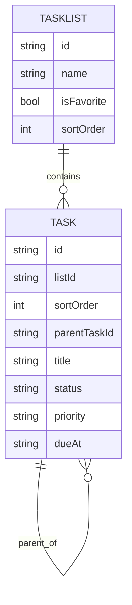

# Data Model / Schema

This doc describes the entities in TaskMaster and how they relate.

## Source of truth today
- TypeScript types: [src/types](../src/types)
- App state + persistence: [src/store](../src/store)

## Backend schema (Amplify GraphQL)
- Amplify GraphQL schema: [amplify/backend/api/taskmaster/schema.graphql](../amplify/backend/api/taskmaster/schema.graphql)

## Core entities (current UI types)
### `TaskUI`
Defined in [src/types/task.ts](../src/types/task.ts)
- `id: string`
- `listId: string`
- `sortOrder: number` (lower = higher in list)
- `parentTaskId?: string | null`
- `title`, `description?`
- `status: TaskStatus` (enum from generated [src/API.ts](../src/API.ts))
- `priority: TaskPriority` (enum from generated [src/API.ts](../src/API.ts))
- `dueAt?: string | null`
- `completedAt?: string | null`
- `assigneeId?: string | null`
- `tagIds: string[]`
- `createdAt`, `updatedAt`: ISO strings

Subtasks are derived (not stored) by filtering tasks where `parentTaskId === <task.id>`.

### `ListUI`
Defined in [src/types/list.ts](../src/types/list.ts)

### `User`
Defined in [src/types/user.ts](../src/types/user.ts). User display info is fetched via Amplify Auth and cached locally.

## Relationships (conceptual)


## Notes on TS vs GraphQL differences
The GraphQL schema models parent/child tasks using `parentTaskId` + secondary indexes.
The UI derives subtasks from `parentTaskId` (and the `taskStore` builds indexes like `childrenByParentId`).

UI-facing models (`TaskUI`, `ListUI`) are mapped from GraphQL responses via [src/api/mappers.ts](../src/api/mappers.ts).

---

## Planned: `UserProfile` (Demo seeding + Settings + Onboarding)

This model is planned for MVP polish. It is not implemented yet.

### Planned GraphQL schema shape for user profile
```graphql
type UserProfile
  @model
  @auth(rules: [
    # Owner is the Cognito user sub (stable unique id)
    { allow: owner, ownerField: "owner", identityClaim: "sub" },

    # Admin override
    { allow: groups, groups: ["Admin"] }
  ]) {
  # Use the Cognito sub as the record id
  id: ID! @primaryKey

  # owner scoping
  owner: String!

  # demo seeding + upgrades
  seedVersion: Int!            # start at 1
  seededAt: AWSDateTime        # nice for debugging

  # onboarding seeding + upgrades
  onboardingVersion: Int!
  onboarding: AWSJSON

  # settings blob + updates
  settingsVersion: Int!        # start at 1
  settings: AWSJSON

  # optional profile fields
  displayName: String
  avatarUrl: String
  lastSeenAt: AWSDateTime
}
```

### UserProfile fields brainstorming (beyond the plan)

Identity / display (lightweight, future-proof)
- `preferredName: String` (can differ from displayName)
- `bio: String` (short)
- `timezone: String` (IANA, e.g. `America/Chicago`)
- `locale: String` (e.g. `en-US`)

App lifecycle + analytics-y but still ethical/minimal
- `lastDeviceId: String` (optional; useful for debugging “why didn’t it sync”)
- `acceptedTermsAt: AWSDateTime` (only if you ever need it)

What could go inside onboarding
- `stepsCompleted: string[]` (e.g. `["createdFirstList","createdFirstTask"]`)
- `dismissedTips: string[]`
- `tourSeenAt: string | null`
- `sampleDataSeeded: boolean` (or derive from `seedVersion`)

“Future you” fields for collaboration (even if not MVP)
- `defaultVisibility: String` (if you ever add shared lists)
- `planTier: String` (`free` | `demo` | `pro`) — optional

## Local persistence structures
This app persists a small set of UI/runtime state in `localStorage` via Zustand `persist`:
- Tasks + lists cache: `taskmaster:taskStore` (see [src/store/taskStore.ts](../src/store/taskStore.ts))
- Updates feed + read markers: `taskmaster:updates` (see [src/store/updatesStore.ts](../src/store/updatesStore.ts))
- Inbox preferences: `taskmaster:inbox` (see [src/store/inboxStore.ts](../src/store/inboxStore.ts))
- User display cache: `taskmaster:user` (see [src/services/userUICacheStore.ts](../src/services/userUICacheStore.ts))
- System inbox list id: `taskmaster.inboxListId` (see [src/config/inboxSettings.ts](../src/config/inboxSettings.ts))

Helper utilities:
- [src/services/storage.ts](../src/services/storage.ts)
