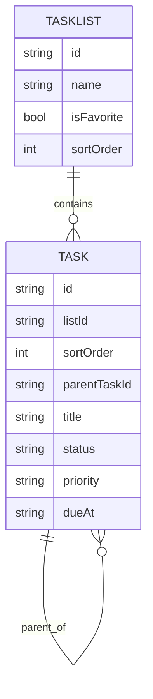

# Data Model / Schema

This doc describes the entities in TaskMaster and how they relate.

## Source of truth today
- TypeScript types: [src/types](../src/types)
- Seed data: [src/mocks](../src/mocks)
- Local persistence overlays: [src/services/taskPatchStore.ts](../src/services/taskPatchStore.ts) and update event store

## Planned backend schema
- Amplify GraphQL schema: [amplify/backend/api/taskmaster/schema.graphql](../amplify/backend/api/taskmaster/schema.graphql)

## Core entities (current TS)
### `Task`
Defined in [src/types/task.ts](../src/types/task.ts)
- `id: string`
- `listId: string`
- `sortOrder: number` (lower = higher in list)
- `parentTaskId?: string | null`
- `subtasks: string[]` (task IDs)
- `title`, `description?`
- `status: "Open" | "Done"`
- `priority: "Low" | "Medium" | "High"`
- `dueAt?: string | null`
- `assigneeId?: string | null`
- `tagIds: string[]`
- `createdAt`, `updatedAt`: ISO strings

### `TaskList`
Defined in [src/types/list.ts](../src/types/list.ts) and seeded in [src/mocks/lists.ts](../src/mocks/lists.ts)

### `User`
Defined in [src/types/user.ts](../src/types/user.ts) and mocked via [src/mocks/currentUser.ts](../src/mocks/currentUser.ts)

## Relationships (conceptual)

## Notes on TS vs GraphQL differences
The GraphQL schema currently models parent/child tasks using `parentTaskId` + the `tasksByParent` index. The TypeScript model also includes `subtasks: string[]`.

> TODO: Decide whether `subtasks` stays as a denormalized array, or whether the UI should derive subtasks solely from `parentTaskId` (which matches the GraphQL model better).

## Local persistence structures
Task mutations in the prototype are persisted locally:
- Patch store key: `taskmaster.taskPatches.v1`
- Event store key: `taskmaster.updateEvents.v1`
- Updates read state key: `taskmaster.updates.v1`

Reference:
- [src/services/taskPatchStore.ts](../src/services/taskPatchStore.ts)
- [src/services/updatesEventStore.ts](../src/services/updatesEventStore.ts)
- [src/services/updatesService.ts](../src/services/updatesService.ts)
